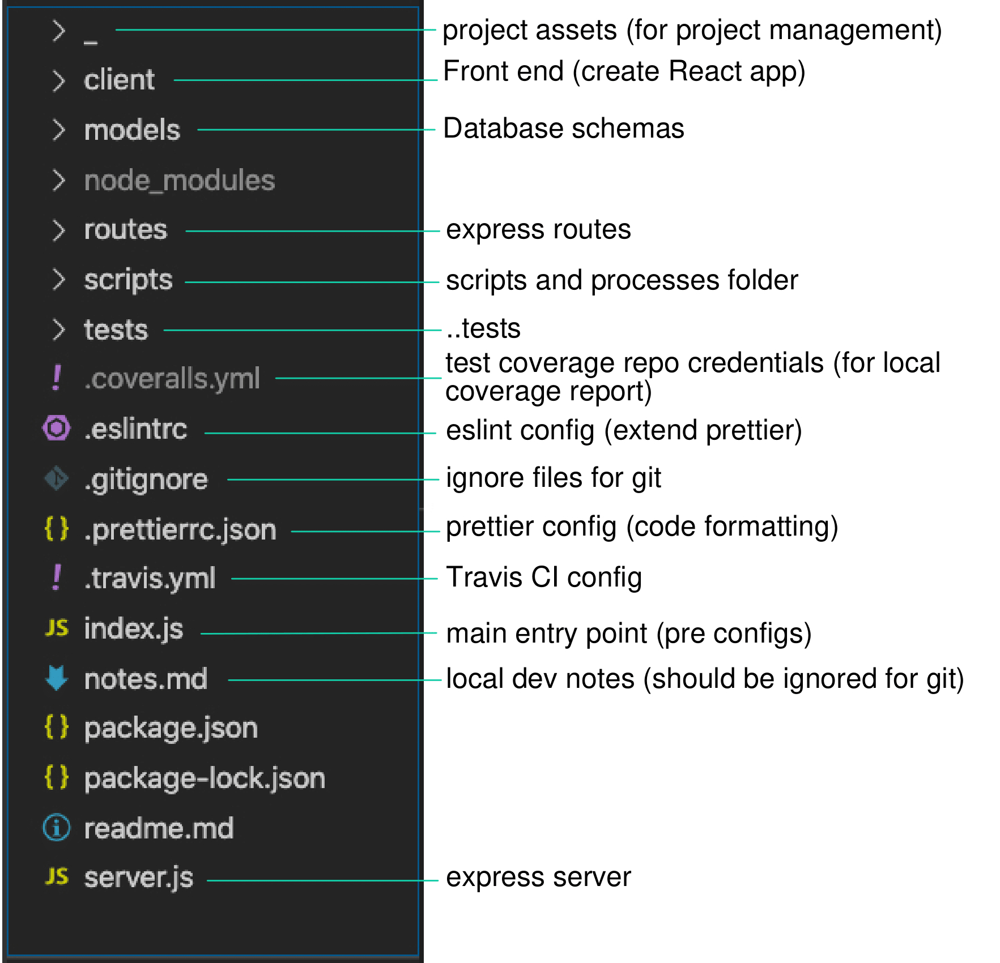
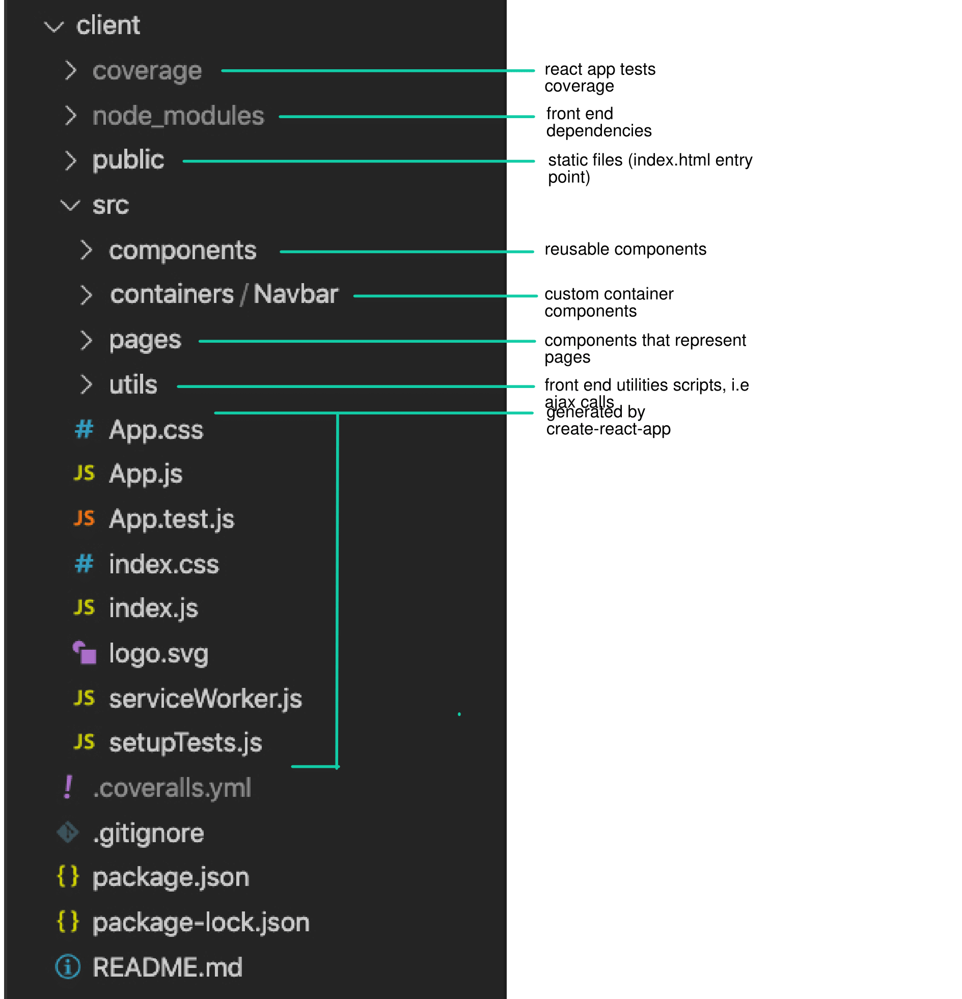
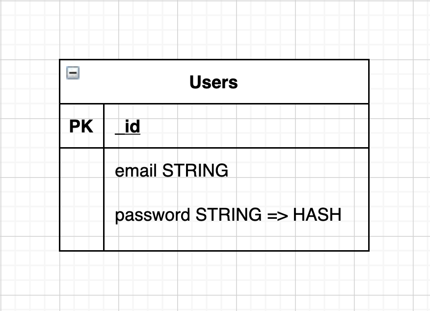

  

## Mongo-Express-React-Passport boilerplate.
 * express backend
 * mogoose + mongodb ( users collection )
 * react ( create react app )
 * user onbaording and authentication flow.
 * server and client error handling. 
 * Travis CI + tests flow
 * express test flow with Jest + coveralls
 * react tests + coveralls

### Demo

### ⚙️ Installation

##### Option 1: copy from gitlab
url tbd.

* if copied from gitlab, remove node_modules.
  1. create git repo
  2. create heroku app + mLab addon 
  3. add repo to coveralls.io
  4. on heroku dashboard create an env var for COVERALLS_REPO_TOKEN with your token.
  5. commit and push (directly to heroku or using a pipeline from github)

##### Option 2: clone from github 
  * follow steps 1-5.

### ⚙️ Installation

##### copy from gitlab or clone the repo
https://columbia.bootcampcontent.com/columbia-bootcamp/cu-nyc-fsf-pt-01-2020-u-c/tree/master/23-Project-3/Suplemental

**Run Locally**
  1. clone/fork the repo or copy from the Gitlab folder.
  2. create a git repo and add the project to it.
  2. `cd` into the root folder.
  3. create a `.env` file with a DB_NAME and DB_PASS variables:
  
  4. run `npm i`
  5. create you local database, from workbench or any sql client: `CREATE DATABASE your-data-base-name`
  5. run `npm start` and 🤞
**Deploy to heroku**
  1. run from the root folder `heroku create your-app-name`
  2. Add JAWS_DB addon (from the heroku app dashboard).
  4. add env vars on heroku app dashboard: SESSION_PASS (with any string).
  3. Add repo to travis-ci.com
  3. Add repo to coveralls.io
  5. Commit and push (directly to heroku or using a pipeline from github) 🚀

### :evergreen_tree: structure

### :evergreen_tree: client structure

### 🗄 DB schemas

* DB schemas should be added to `models/CollectionName.js`

##### Users

### 🔑 Key files

* ❗️ Add `.env` file to to root project folder in order to add env vars locally (being read at index.js)

#### server side 
* 🚀 index.js : entry point, set up dev env vars and other config before starting server, run server.

* 💻 server.js parts by order (mainly):
   * express
   * mongoose 
   * session storage (for user authentication) + hanler in scripts.
   * request body parsing middlewere (json, urlencoded)
   * serving static files
   * routes
   * serve react app (last result to pick up request)
   * error handling middleware (handler in scripts)
   * connection to db
   * listen to port (server starts)

* 🗄 Models folder: collections

#### client side 
* App: entry point, user state, passes to relevant components.
* Navbar container: logs every render, user onboarding bottons.
* components/protectedRoute: renders the protected page only if there is a user in the sate.
* login: class components, ..logs in users

### 📦 Services and packages:

  
  * [heroku](heroku.com) 
  * [Jest](https://jestjs.io/) (client and express tests)
  * [travis](https://travis-ci.org/)
  * [coveralls](coveralls.io) 
    * will show coverage report of both client tests and server tests (they run seperatly).

### 📓 Tests
   * **Jest** is used for both client and express.

   * Run tests from root folder:
    * on express server
      * `npm run test`
      * with run with cover report: 
      `npm run coveralls`
    * client tests locally:
      * `cd client && npm run test`
   * todo: api routes with **Supertest**.
   * todo: components test with **enzyme**.
   * coverage reports with coveralls.

### continues integration
   * tests are run by travis from the `.travis.yml` file.

### Recommended next steps :

  * [Production best practices with Express.js](https://expressjs.com/en/advanced/best-practice-performance.html)

